# Rqwatch Screenshots

  

    
<h2>Menu and Color codes</h2>

    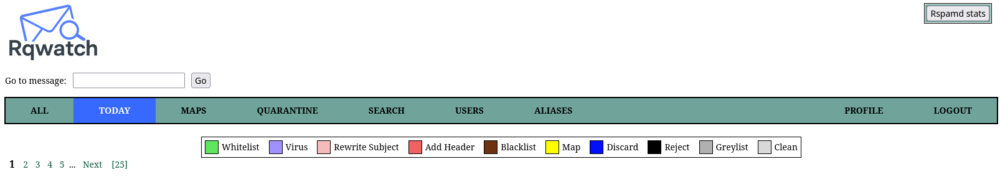
  

  

    
<h2>Mail Logs</h2>

    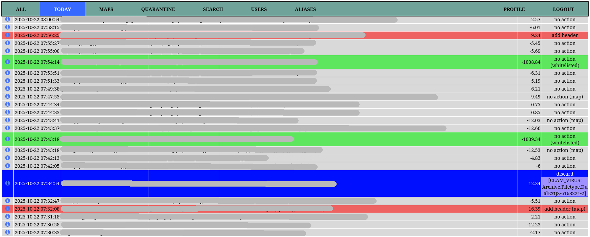
  

  

    
<h2>Mail Detail</h2>

    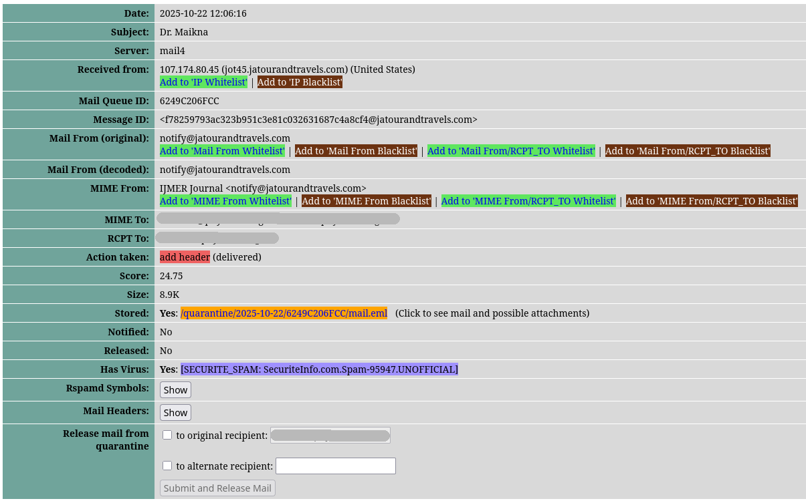
  

  

    
<h2>Mail Headers</h2>

    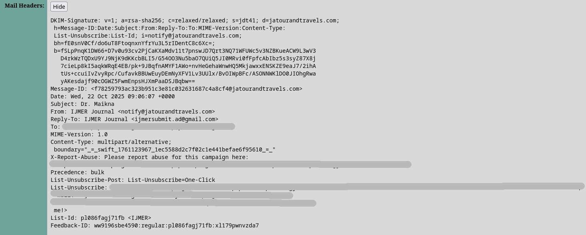
  

  

    
<h2>Rspamd Headers</h2>

    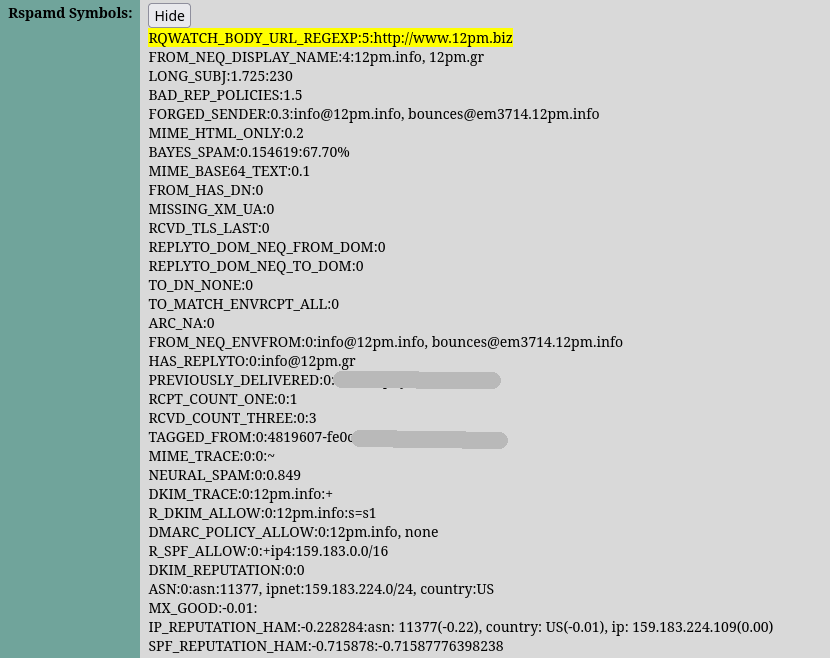
  

  

    
<h2>Rspamd Statistics</h2>

    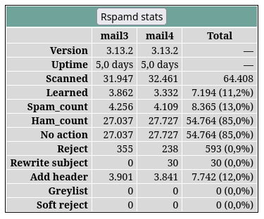
  

  

    
<h2>Release Mail</h2>

    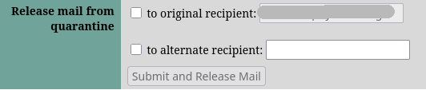
  

  

    
<h2>Quarantine</h2>

    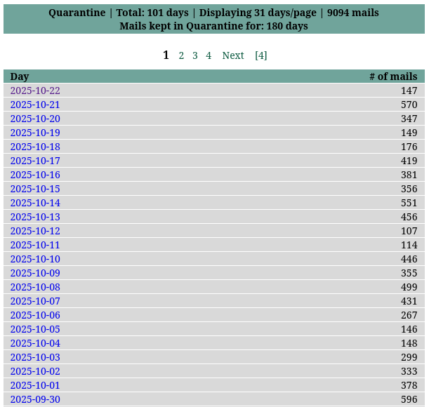
  

  

    
<h2>Stored Mail View</h2>

    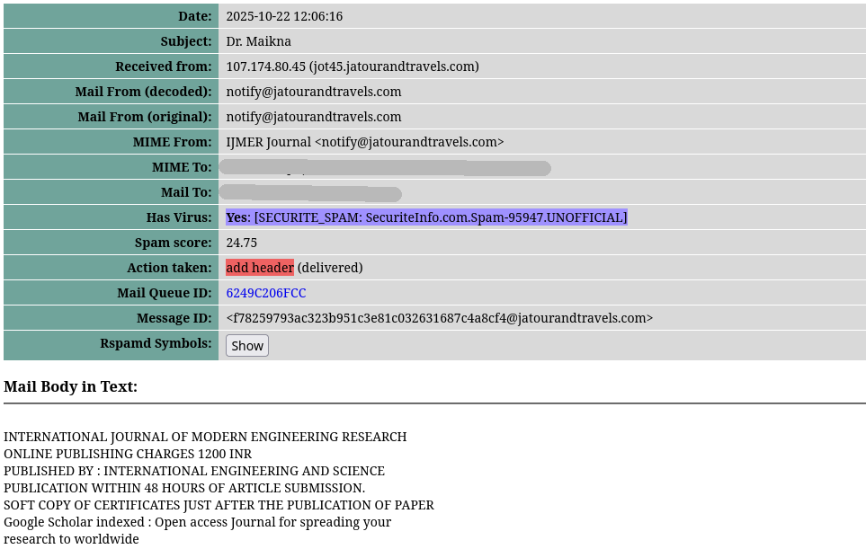
  

  

    
<h2>Stored Mail View HTML</h2>

    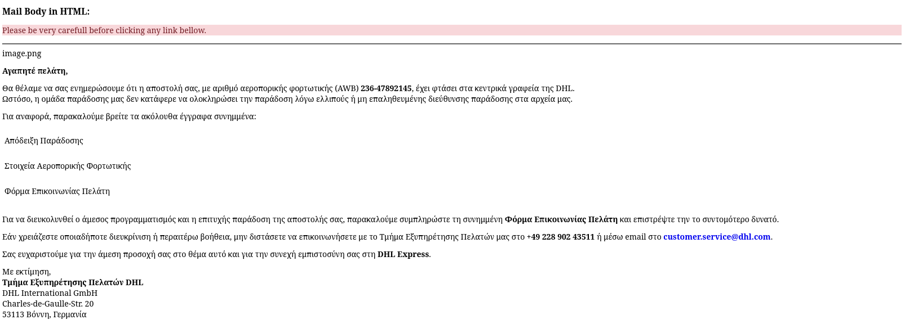
  

  

    
<h2>Stored Mail Attachments</h2>

    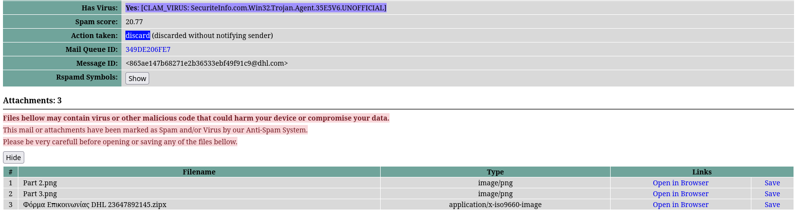
  

  

    
<h2>Search Filters</h2>

    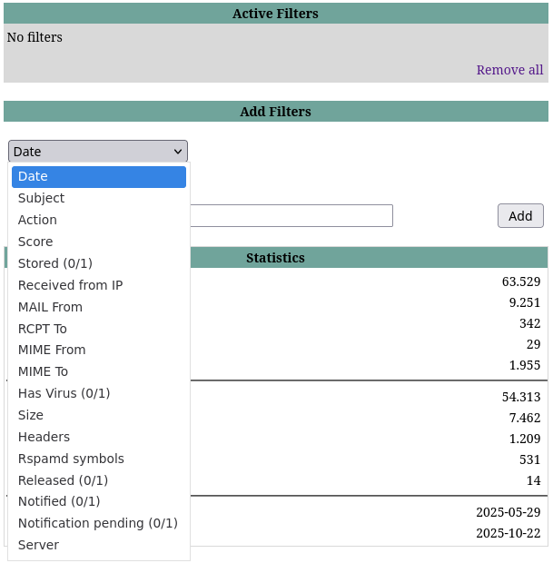
  

  

    
<h2>Search Active Filters</h2>

    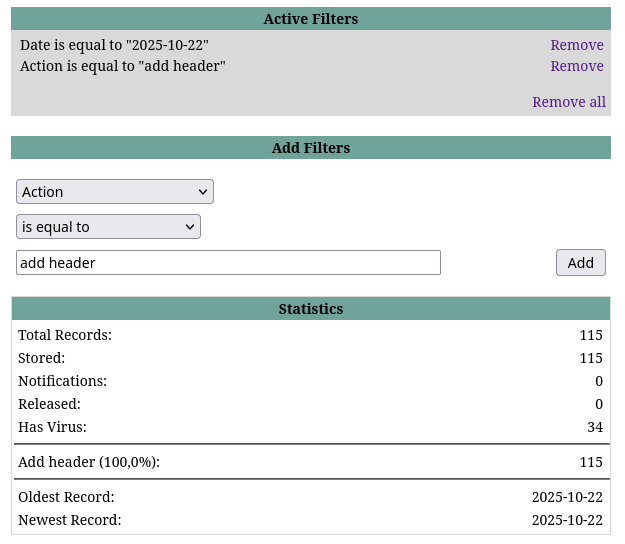
  

  

    
<h2>Search Results and Reports</h2>

    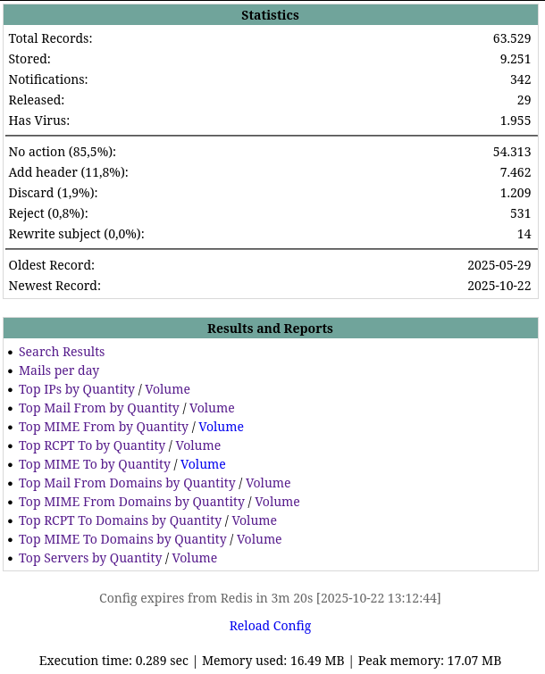
  

  

    
<h2>Combined Maps</h2>

    
  

  

    
<h2>Custom Maps</h2>

    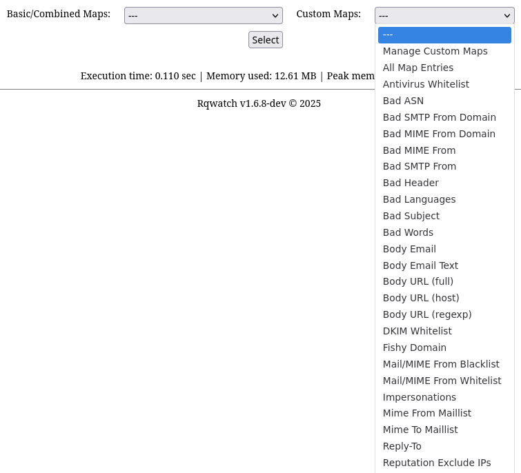
  

  

    
<h2>Custom Maps Management</h2>

    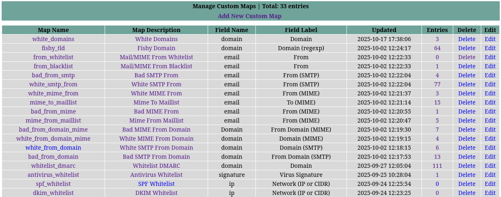
  

  

    
<h2>Map Entries</h2>

    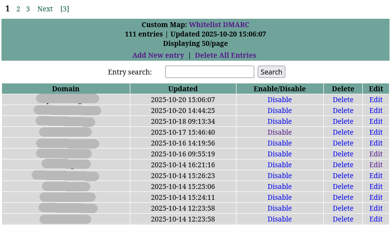
  

  

    
<h2>Users</h2>

    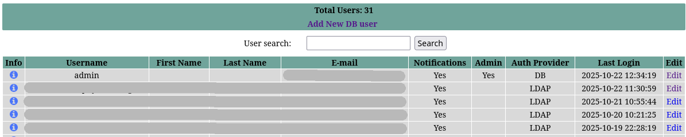
  

  

    
<h2>User Profile</h2>

    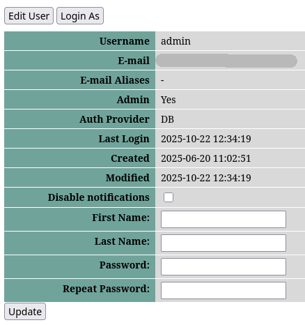
  

  

    
<h2>Mail Aliases</h2>

    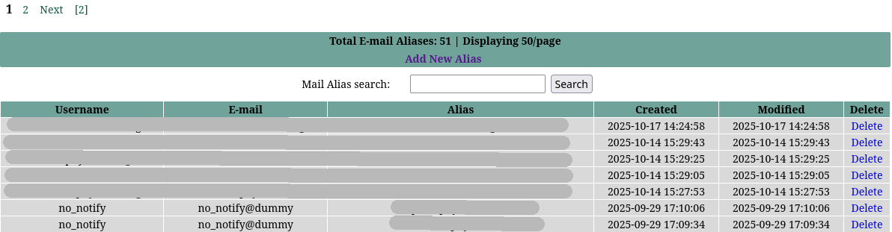
  

